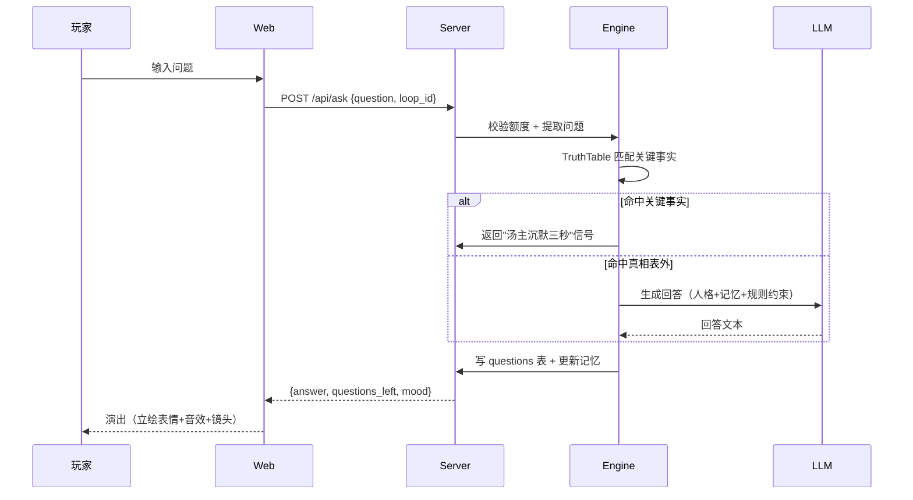
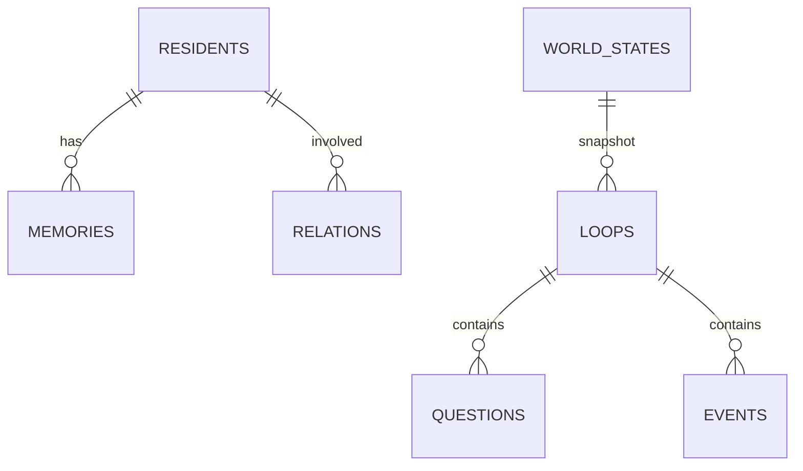

# 架构说明（定稿）

> 本文档描述《轮回渡口》的运行时架构。配合 `docs/SPEC.md`（产品）与 `docs/TECHNOLOGY.md`（技术选型）阅读。

> ⚠️ **迁移状态（2026-08-21 起）**：项目已从 Web 版转向**桌面化（Godot 客户端 + 云 AI 后端）**，见
> [DESKTOP_MIGRATION.md](DESKTOP_MIGRATION.md)。下列第 1～7 节描述的 `@lunhui/web` 演出层与 SSE 事件流
> 已被 **Godot 客户端（`app/`）改用 HTTP 审问、事件流已由 SSE 改为 WebSocket** 所取代；engine/server 分层、
> 真相表/记忆/LLM 容灾与数据表**保持不变**。目标运行时拓扑见下文「迁移后的目标架构」。

## 迁移后的目标架构

```
┌─ Windows 桌面客户端（Godot 4.8 mono / C#）──────────┐
│  演出层：Blender 3D 场景 + 2D 立绘 + 雨夜/粒子/音频   │
│  对话·选择·轮回 UI · 本地存档（user://）              │
│  HTTP / WebSocket（事件流）──────────────┐          │
└──────────────────────────────────────────┼──────────┘
                                           ▼
┌──────── 云 AI 后端（@lunhui/server / Fastify 5）─────┐
│  JWT 账号/鉴权 · 多玩家额度与记忆隔离(player_id) · 限流│
│  真相表判定(@lunhui/engine) · LLM 多 provider 容灾     │
│  SQLite(better-sqlite3)                              │
└─────────────────────────────────────────────────────┘
```

## 1. 总体分层

```
┌────────────────────────────────────────────────┐
│ 演出层 @lunhui/web (React 19)                    │
│  立绘表情 / 背景 / 雨雾动态 / 音乐音效 / 镜头     │
│  审问界面 / 选择界面 / 轮回动画 / 小镇日报         │
├────────────────────────────────────────────────┤
│  API 层 @lunhui/server (Fastify 5)              │
│  /api/loop  轮回生命周期                          │
│  /api/ask   审问（10 问额度）                    │
│  /api/memory 记忆查询                            │
│  /api/event 事件流（SSE 推送）                   │
├────────────────────────────────────────────────┤
│ 引擎层 @lunhui/engine                           │
│  TruthTable  真相表判定（骨架锁死）               │
│  Generator   LLM 血肉生成（多 provider 容灾）     │
│  Memory      记忆系统（衰减/永久节点）            │
│  Relation    关系网（恩怨涌现）                  │
│  Event       事件发生器（线索/陷阱）              │
├────────────────────────────────────────────────┤
│ 数据层 SQLite（better-sqlite3）                  │
│  residents / loops / memories / events          │
│  questions / world_states                       │
└────────────────────────────────────────────────┘
```

## 2. 核心数据流：一次审问



## 3. 引擎四个模块的边界（不互相越权）

| 模块 | 职责 | 禁止 |
|---|---|---|
| TruthTable | 判断问题是否命中关键事实 | 生成文本 |
| Generator | 调用 LLM 生成文本 | 修改真相表 |
| Memory | 读写记忆、衰减 | 决定剧情走向 |
| Event | 生成日常事件（线索/陷阱） | 修改玩家额度 |

## 4. 数据表关系



## 5. 关键设计约束

1. **生成必须回流**：Generator 的输出写入 Memory/Events，成为后续输入（否则是假动态）；
2. **真相表不可变**：TruthTable 是唯一"谜底"，任何生成不得违背（防失控）；
3. **额度在 Server 层强制**：10 问额度由 Server 校验，Engine 不信任前端；
4. **SSE 用于事件流**：小镇日常/轮回动画用 SSE 推送，避免轮询。

## 6. 部署形态

```
开发：本地三进程（tsx watch × 3），Vite 代理 /api → 8787
生产：ECS + PM2
  - web: 构建产物由 nginx 托管（或 Fastify 静态托管）
  - server: PM2 单实例
  - engine: 库，被 server 引用（同进程）
```

## 7. 演进触发（何时拆分）

- engine 计算过重 → 拆独立 worker 进程（同机）；
- 需要横向扩展 → server 无状态化 + Postgres + Redis 记忆缓存。
