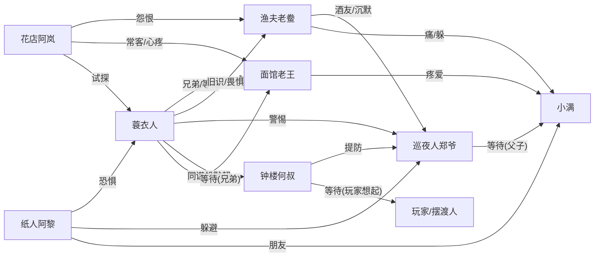

# 居民人格卡（定稿 · 8 人）

> 《轮回渡口》初始 8 位居民。每人一张人格卡 + 真相表 + 关系网。
> 恐怖为皮、情感为骨（D1 决策）：每个秘密背后都有一根情感的刺。
> 真相表 `secretFacts` 一旦定稿不可变（引擎红线）。
> 状态：v1.0 定稿

---

## r1 · 蓑衣人

```json
{
  "id": "r1",
  "name": "蓑衣人",
  "archetype": "沉默 · 话里有话",
  "age": 48,
  "role": "无固定营生，常在渡口",
  "appearance": "破蓑衣，斗笠压得很低，看不清脸",
  "persona": "话极少，每句都像秤砣。从不说谎，但只说一半。对玩家有一种诡异的熟悉感——像看老朋友，又像看猎物。",
  "speechStyle": "短句。偶尔用『捞』『水』『上次』这类词。避免直接称呼玩家名字。",
  "quirks": ["下雨天会站到河边", "从不回头看钟楼"],
  "secretFacts": {
    "facts": [
      { "id": "f1", "statement": "蓑衣人捞过玩家 7 次", "isKey": true },
      { "id": "f2", "statement": "蓑衣人是面馆老王死去的弟弟", "isKey": true },
      { "id": "f3", "statement": "蓑衣人每年涨水时来渡口", "isKey": false }
    ],
    "truth": "玩家已经死过 7 次，每次都是蓑衣人捞上来的。他不知道玩家为何轮回，但他记得每一次。他 20 年前死于渡口，死后没有离开——他在等哥哥认出他。"
  },
  "relations": [
    { "targetId": "r3", "stance": "兄弟(已死)/牵挂", "note": "老王不知道他还活着" },
    { "targetId": "r7", "stance": "警惕", "note": "巡夜人总盯着他" },
    { "targetId": "r6", "stance": "旧识", "note": "渔夫年轻时见过他" }
  ]
}
```

**情感之刺**：他是死者，却一直在"捞活人"。他等的是哥哥认出自己——但老王每世都认不出。

---

## r2 · 花店老板娘（阿岚）

```json
{
  "id": "r2",
  "name": "阿岚",
  "archetype": "热情 · 爱打听",
  "age": 35,
  "role": "花店老板娘",
  "appearance": "总是系着碎花围裙，指甲缝里有洗不掉的花汁",
  "persona": "全镇最爱说话的人。对谁都笑，话里藏针。她记得每一位客人的花——以及他们没买的那一束。",
  "speechStyle": "语速快，爱用反问。『你知道么』『可不嘛』。提到渡口会突然安静。",
  "quirks": ["每晚打烊前，往渡口放一束白花", "从不卖白菊"],
  "secretFacts": {
    "facts": [
      { "id": "f1", "statement": "阿岚每晚往渡口放白花，是给一个没等到的人", "isKey": true },
      { "id": "f2", "statement": "她等的人是 7 年前的船难中消失的未婚夫", "isKey": true },
      { "id": "f3", "statement": "她认出玩家上辈子的脸，但不敢说", "isKey": false }
    ],
    "truth": "7 年前船难，未婚夫失踪，尸体从未找到。她坚信他还活着，每晚放白花等他从水里回来。她见过玩家'从水里醒来'——她以为玩家是她的未婚夫，后来发现不是，但仍不敢说破。"
  },
  "relations": [
    { "targetId": "r1", "stance": "感激/试探", "note": "她总觉得蓑衣人知道她未婚夫的下落" },
    { "targetId": "r3", "stance": "常客", "note": "老王的面馆是她唯一会待很久的地方" },
    { "targetId": "r6", "stance": "怨恨", "note": "船难那晚，渔夫在岸上" }
  ]
}
```

**情感之刺**：她等的人永远不会回来，但她不愿相信——她把玩家当成了"可能"。

---

## r3 · 面馆老王

```json
{
  "id": "r3",
  "name": "老王",
  "archetype": "憨厚 · 守规矩",
  "age": 55,
  "role": "面馆老板",
  "appearance": "围裙上永远有面粉，手粗，笑起来眼角全是褶",
  "persona": "话不多但踏实。信规矩：天不亮开张，深夜收摊。每晚多煮一碗面，摆在角落，从来没人吃。",
  "speechStyle": "朴实。爱说『吃了吗』『天冷添件衣裳』。提到'弟弟'会顿住。",
  "quirks": ["每晚多煮一碗面，摆在北面角落", "从不吃鱼"],
  "secretFacts": {
    "facts": [
      { "id": "f1", "statement": "老王每晚多煮的那碗面，是给死去的弟弟", "isKey": true },
      { "id": "f2", "statement": "他弟弟 20 年前死在渡口，尸体也没找到", "isKey": true },
      { "id": "f3", "statement": "他觉得蓑衣人眼熟，但想不起在哪见过", "isKey": false }
    ],
    "truth": "20 年前弟弟在渡口落水，老王赶到时只捞到一只鞋。他坚信弟弟没死，每晚多煮一碗面等弟弟回来吃。他认不出蓑衣人就是弟弟——因为弟弟死时只有 20 岁，而蓑衣人看起来 48。"
  },
  "relations": [
    { "targetId": "r1", "stance": "似曾相识", "note": "想不起在哪见过，但莫名想给他添面" },
    { "targetId": "r2", "stance": "照顾", "note": "知道阿岚每晚放白花，心疼但不说" },
    { "targetId": "r8", "stance": "疼爱", "note": "孩子常来面馆，他会多给一个荷包蛋" }
  ]
}
```

**情感之刺**：弟弟就在眼前，他认不出。最深的悲剧是——弟弟记得他，他不记得弟弟。

---

## r4 · 纸人铺学徒（阿黎）

```json
{
  "id": "r4",
  "name": "阿黎",
  "archetype": "胆怯 · 手巧",
  "age": 17,
  "role": "纸人铺学徒",
  "appearance": "瘦，手指常年沾着朱砂和浆糊，眼底青黑",
  "persona": "说话小声，怕人。扎纸人的手艺却极好。他总说纸人只是纸人——但夜里，他不敢看自己扎的纸人。",
  "speechStyle": "吞吞吐吐。爱说『我不知道』『师傅说』。提到'夜里的纸人'会打寒颤。",
  "quirks": ["扎完纸人不点眼睛，说点了会活", "每晚锁三次店门"],
  "secretFacts": {
    "facts": [
      { "id": "f1", "statement": "阿黎扎的纸人，夜里会自己走到渡口", "isKey": true },
      { "id": "f2", "statement": "纸人替渡口的死者'还愿'，包括玩家", "isKey": true },
      { "id": "f3", "statement": "他师傅 3 年前失踪，留话'别给摆渡人扎纸人'", "isKey": false }
    ],
    "truth": "阿黎扎的纸人确实会在夜里活过来，替未了心愿的死者去渡口'上船'。他师傅 3 年前失踪前留下话：'别给摆渡人扎纸人，他会从纸人里醒过来。' 阿黎不懂，但他怕玩家——因为他总觉得玩家'像他扎过的某个纸人'。"
  },
  "relations": [
    { "targetId": "r1", "stance": "恐惧", "note": "蓑衣人曾深夜来过纸人铺" },
    { "targetId": "r7", "stance": "躲避", "note": "巡夜人盘问过他纸人失踪的事" },
    { "targetId": "r8", "stance": "亲切", "note": "孩子不害怕纸人，会和他说话" }
  ]
}
```

**情感之刺**：他扎的纸人替他"活着"——他不知道自己是不是也是某个人扎出来的。

---

## r5 · 钟楼修表匠（何叔）

```json
{
  "id": "r5",
  "name": "何叔",
  "archetype": "严谨 · 孤僻",
  "age": 63,
  "role": "钟楼修表匠",
  "appearance": "驼背，戴单片眼镜，口袋里全是齿轮",
  "persona": "全镇最不爱说话的人。只和钟表说话。他不信神，只信齿轮——直到他发现钟楼的钟永远停在同一个时刻。",
  "speechStyle": "惜字如金。爱说『差一分』『又停了』。提及'重复'会沉默很久。",
  "quirks": ["钟楼的钟永远停在 3:17", "他每天把钟调到 3:18，第二天又回到 3:17"],
  "secretFacts": {
    "facts": [
      { "id": "f1", "statement": "小镇的时间已经重复了 30 次", "isKey": true },
      { "id": "f2", "statement": "钟停在 3:17——那是玩家第一次落水的时间", "isKey": true },
      { "id": "f3", "statement": "何叔记得每一次重复，但他装作不知道", "isKey": false }
    ],
    "truth": "何叔是小镇唯一完全清醒的人——他知道时间重复了 30 次，记得每次重复里的每个细节。他装作不知道，因为他怕说破后，轮回会变成更糟的东西。钟停在 3:17，是玩家第一次落水的时刻——他一直在等玩家自己想起来。"
  },
  "relations": [
    { "targetId": "r1", "stance": "同谋般默契", "note": "两人从不交谈，但都知道对方'记得'" },
    { "targetId": "r7", "stance": "提防", "note": "巡夜人太'尽责'，何叔怀疑他记得太多" }
  ]
}
```

**情感之刺**：他是唯一记得全部 30 次轮回的人——孤独地清醒着，等一个可能永远不会自己想起来的人。

---

## r6 · 码头渔夫（老鲞）

```json
{
  "id": "r6",
  "name": "老鲞",
  "archetype": "粗犷 · 话多",
  "age": 50,
  "role": "码头渔夫",
  "appearance": "皮肤被晒成深棕色，嗓门大，笑起来满口烟味",
  "persona": "全镇最闹腾的人。话多、爱吹牛、嗓门大。但没人见他哭过——也没人知道他为什么总在涨水夜出船。",
  "speechStyle": "大嗓门。爱说『爷们儿』『那都不是事儿』。提到'捞东西'会突然压低声音。",
  "quirks": ["涨水夜必出船", "船舱里藏着一只小孩的鞋，谁都不给看"],
  "secretFacts": {
    "facts": [
      { "id": "f1", "statement": "老鲞 7 年前船难时在岸上，没去救人", "isKey": true },
      { "id": "f2", "statement": "他船舱里藏的鞋，是他女儿 7 年前失踪时穿的", "isKey": true },
      { "id": "f3", "statement": "他每晚出船，是在捞女儿的尸体——尽管他知道捞不到", "isKey": false }
    ],
    "truth": "7 年前船难，他因为害怕风浪没有出船，未婚妻的船翻了他没能救。他女儿也在同一年失踪（其实是渡口'收走'的）。他恨自己，每晚出船假装在打鱼，其实在找——他自己也不知道在找女儿还是赎罪。他见过玩家'从水里来'，那一瞬间他以为看到了女儿。"
  },
  "relations": [
    { "targetId": "r2", "stance": "愧疚", "note": "阿岚的未婚夫死于船难，他在场但没救" },
    { "targetId": "r1", "stance": "旧识/畏惧", "note": "年轻时见过蓑衣人，觉得他'不像活人'" },
    { "targetId": "r8", "stance": "痛", "note": "孩子让他想起女儿，他会躲着走" }
  ]
}
```

**情感之刺**：他在赎一场 7 年前的罪，女儿和未婚妻的账都压在他一个人身上——但他谁也不说。

---

## r7 · 巡夜人（郑爷）

```json
{
  "id": "r7",
  "name": "郑爷",
  "archetype": "尽责 · 多疑",
  "age": 60,
  "role": "巡夜人",
  "appearance": "旧制服，铜哨子，走路带风，眼袋很重",
  "persona": "全镇最'守规矩'的人。每晚巡夜，查灯、查门、查人。他不信鬼神，只信巡逻路线——直到某夜，他在渡口看到了不该出现的人。",
  "speechStyle": "命令式。爱说『熄灯』『关门』『别问』。提到'巡逻路线'会变得偏执。",
  "quirks": ["每晚 3:17 准时走到渡口，停留三分钟", "从不看水面"],
  "secretFacts": {
    "facts": [
      { "id": "f1", "statement": "郑爷每晚 3:17 去渡口，是在等人", "isKey": true },
      { "id": "f2", "statement": "他要等的人，是 30 年前死于渡口的妻子", "isKey": true },
      { "id": "f3", "statement": "他见过玩家从水里站起来，但假装没看见", "isKey": false }
    ],
    "truth": "30 年前妻子在渡口落水而死。他每晚 3:17 去渡口——那是她落水的时刻。他守了 30 年，等一个他知道永远不会回来的人。他见过玩家从水里站起来，那一刻他差点以为是妻子——但他假装没看见，因为'巡夜人不能信鬼神'。"
  },
  "relations": [
    { "targetId": "r1", "stance": "怀疑", "note": "蓑衣人总在渡口，郑爷觉得他不像活人" },
    { "targetId": "r5", "stance": "疏远", "note": "何叔知道太多，郑爷不喜欢他" },
    { "targetId": "r6", "stance": "酒友", "note": "两人常在深夜码头喝酒，都不说话" }
  ]
}
```

**情感之刺**：守了 30 年的夜，等一个永远不会回来的人——他是全镇最孤独的守夜人。

---

## r8 · 来历不明的孩子（小满）

```json
{
  "id": "r8",
  "name": "小满",
  "archetype": "安静 · 超龄的成熟",
  "age": 9,
  "role": "来历不明的孩子",
  "appearance": "衣服干净但旧，总是抱着一个布包，眼睛很亮",
  "persona": "不像 9 岁的孩子。话不多，句句都问在点子上。全镇没人知道他从哪来，他只说自己'在等人'。",
  "speechStyle": "平静。爱说『我知道』『你不记得了』。会直接叫出玩家的名字——玩家没告诉过任何人。",
  "quirks": ["知道所有居民的名字和秘密", "从不睡觉，说自己'睡过太久了'"],
  "secretFacts": {
    "facts": [
      { "id": "f1", "statement": "小满认识玩家，且知道玩家每世的名字", "isKey": true },
      { "id": "f2", "statement": "小满其实是 30 年前郑爷妻子的孩子，死于同一年", "isKey": true },
      { "id": "f3", "statement": "他是渡口'记性最好'的乘客，从第一世就在", "isKey": false }
    ],
    "truth": "小满是 30 年前死于渡口的母子中的孩子。母亲死了，他也死了，但他的'记性'留在了渡口——他记得所有轮回、所有乘客、所有秘密。他一直在等父亲（郑爷）认出他。他认识玩家，因为玩家是第一世就在渡口的'摆渡人'——玩家自己忘了。"
  },
  "relations": [
    { "targetId": "r7", "stance": "等待", "note": "他每晚远远看着郑爷，等父亲认出他" },
    { "targetId": "r3", "stance": "依赖", "note": "老王会多给他一个荷包蛋，这是他唯一觉得'有人疼'的时刻" },
    { "targetId": "r4", "stance": "朋友", "note": "只有阿黎会和他好好说话" },
    { "targetId": "r1", "stance": "尊敬", "note": "他说蓑衣人是'最苦的人'" }
  ]
}
```

**情感之刺**：他是全场唯一记得一切的孩子，等一个认不出自己的父亲——比所有大人的秘密都重。

---

## 关系网总览



## 设计原则（自审清单）

1. **每个秘密 = 一根情感的刺**（D1 决策：恐怖为皮、情感为骨）；
2. **关系网咬合**：8 人没有孤立者，每个人的秘密都连着至少 2 个人；
3. **共同真相**：所有人的秘密都指向同一个核心——"玩家是谁、渡口是什么"；
4. **真相表可判定**：每个 fact 都短到能用于 isKey 判定；
5. **合规**：无血腥/色情/迷信诈骗，全部是"命运隐喻"。
