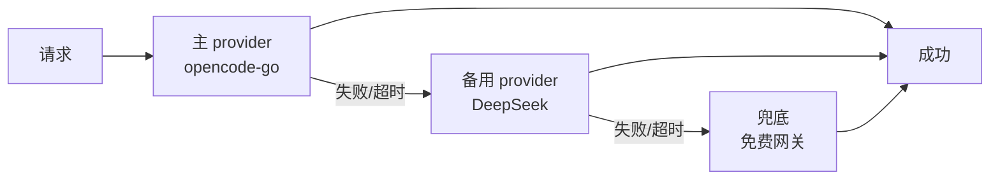

# 技术栈与工具链（定稿）

> 本文档是《轮回渡口》技术选型的**唯一权威依据**。任何变更须先更新本文档再改代码。
> 状态：v1.0 定稿

## 1. 核心语言

| 项 | 选型 | 理由 |
|---|---|---|
| 语言 | TypeScript（全仓统一） | 全栈同构、类型安全、生态成熟 |
| 运行时 | Node.js ≥ 20（.nvmrc 锁定 20） | LTS、ESM 原生支持 |
| 模块 | ESM（`"type": "module"`） | 现代标准、tree-shaking 友好 |

## 2. 包结构（monorepo，npm workspaces）

| 包 | 职责 | 技术 |
|---|---|---|
| `@lunhui/engine` | AI 生成引擎：真相表判定、记忆系统、关系网、事件发生器 | TS + node:test |
| `@lunhui/server` | API 服务：审问/轮回/记忆路由 | Fastify 5 + SQLite |
| `@lunhui/web` | 前端演出层：五件套（立绘/背景/动态/音效/镜头） | React 19 + Vite 6 |

## 3. 关键依赖选型

| 用途 | 选型 | 备选（否决理由） |
|---|---|---|
| 后端框架 | **Fastify 5** | Express（性能/插件生态差）、NestJS（重） |
| 数据库 | **SQLite（better-sqlite3）** | Postgres（量级上来再迁，路径已在 SPEC 定义） |
| 前端构建 | **Vite 6** | Webpack（慢）、CRA（已弃） |
| UI 框架 | **React 19** | Vue（用户主战场是 React） |
| LLM 客户端 | **OpenAI SDK（兼容任意 OpenAI 端点）** | 自写 HTTP（重复造轮子） |
| 测试 | **node:test（内置）+ tsx** | Jest（重）、Vitest（web 包需要时再加） |
| 类型检查 | **tsc --noEmit** | —— |
| Lint | **ESLint 9 flat config + typescript-eslint** | 旧 .eslintrc（已弃） |
| 格式 | **Prettier 3** | —— |
| 开发运行 | **tsx watch** | ts-node（慢、ESM 支持差） |

## 4. LLM 多 Provider 容灾策略（项目红线）



- 环境变量：`.env.example` 已定义 `LLM_PRIMARY_*` / `LLM_FALLBACK_*` / `LLM_LAST_RESORT_*`；
- **红线**：任何单一 provider 挂了不得导致服务不可用；
- 实现位置：`@lunhui/engine` 的 LLM 客户端层。

## 5. 代码质量门槛（CI 强制）

```
提交前必须通过（本地跑，CI 也会跑）：
  npm run lint       # 0 error
  npm run typecheck  # 0 error
  npm run test       # 0 fail
  npm run build      # 全部产出
```

## 6. 环境变量清单

| 变量 | 必填 | 说明 |
|---|---|---|
| `LLM_PRIMARY_BASE_URL` / `API_KEY` / `MODEL` | ✅ | 主 provider |
| `LLM_FALLBACK_*` | 建议 | 备用 provider |
| `LLM_LAST_RESORT_*` | 建议 | 兜底 provider |
| `PORT` | 否 | 默认 8787 |
| `HOST` | 否 | 默认 127.0.0.1 |
| `NODE_ENV` | 否 | development/production |
| `DB_PATH` | 否 | 默认 `./data/lunhui.db` |

## 7. 明确否决项（避免未来走回头路）

- ❌ 不用 ORM（手写 SQL 更可控，表结构简单）
- ❌ 不用 GraphQL（REST 足够）
- ❌ 不引入微服务/消息队列（规模不需要）
- ❌ 不引入 CSS 框架（演出层用 CSS 变量 + 手写，避免风格束缚）
- ❌ 不用 monorepo 之外的包管理器（npm workspaces 已够）

## 8. 演进路线（何时允许变更）

| 触发条件 | 变更 |
|---|---|
| 用户量 > 1 万 / 并发 > 100 | SQLite → Postgres |
| 需要复杂状态管理 | React 加 Zustand |
| 需要前端组件测试 | 加 Vitest + Testing Library |
| 需要多人协作开发 | 加 Changesets 管理版本 |
