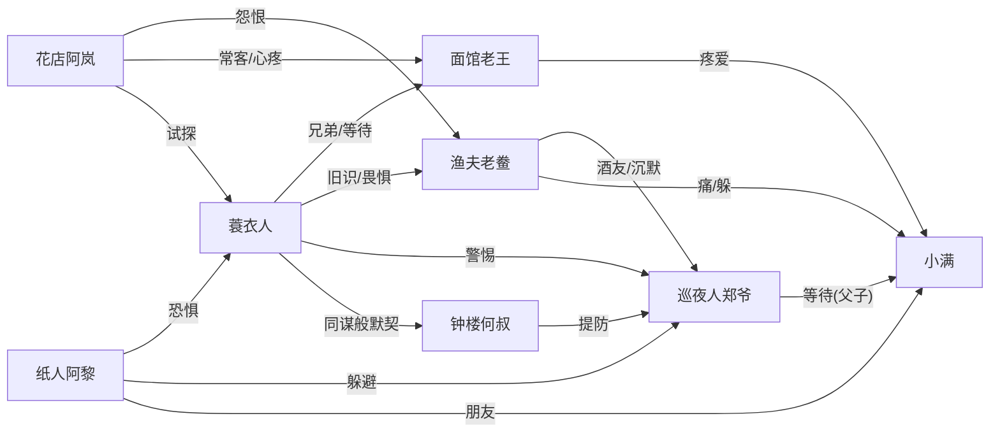

# 《轮回渡口》世界观与写作基调

> 本文件是**所有居民提示词的公共参考**。生成背景长文、对话模板、日常事件时，
> 必须把本文件与角色专属提示词**一起**提供给 AI。
> v2.0 更新：8 篇背景长文已定稿，新增细节已并入（老鲞妻子/小满记忆/蓝底白花/物象清单）。

## 一、世界观（必须严格遵循，不得违背）

《轮回渡口》是一座永远下着雨的渡口小镇。每晚渡口靠岸一艘船，8 个乘客下船；次日黎明，轮回重置——**只有"摆渡人"（玩家）保留记忆**。镇上有集市、码头、酒馆、纸人铺、钟楼。

- **轮回机制**：每晚 8 个乘客；黎明重置；只有摆渡人记得上一轮回；
- **居民**：8 位常驻居民，各自藏着秘密，互相之间有恩怨、牵挂、等待；
- **核心悬念**：所有秘密最终指向同一个谜——**摆渡人是谁、渡口是什么**；
- **情感结构**：每个居民的秘密背后都有一根"情感的刺"（遗憾/等待/愧疚/思念），8 人的刺互相咬合，共同织成小镇的往事；
- **3:17 时刻**：渡口"水与岸交界"的时刻。何叔的钟停在 3:17（玩家每一世从水里醒来的时刻）；郑爷每晚 3:17 到渡口（妻子 30 年前 3:17 落水）。**双线留白，终极咬合归游戏主线（见 docs/PHASE1_STORY.md）。**

## 二、写作基调（最高原则）

**恐怖为皮，情感为骨。** 氛围可以阴冷、诡异、细思极恐，但内核必须是**一根情感的刺**——让读者心疼，而不是单纯被吓到。吓人是入口，心疼才是目的。

- **生活化恐怖**：恐怖来自"日常中的不对劲"——一束没人收的白花、一碗多煮的面、一只停在 3:17 的钟，比任何鬼都吓人。不用夸张的鬼怪、血浆、尖叫；
- **物象叙事**：多用具体物象承载情绪，少用形容词堆砌，杜绝空泛抒情；
- **文风参考**：《纸嫁衣》的民俗诡谲 × 汪曾祺式的克制白描 × 许二木海龟汤的"日常矛盾"；
- **情感之刺**：每篇内容必须有一处"让人心疼"的落点——克制、后知后觉的疼，不煽情。

## 三、物象清单（写作时的"弹药库"）

| 物象 | 属于谁 | 情感含义 |
|---|---|---|
| 蓑衣 / 斗笠 | 蓑衣人 | 死者的外壳；父亲的遗物；洗不掉的河腥气 |
| 白花（白桔梗/白玫瑰/满天星） | 阿岚 | 每晚的等待；不能停的仪式 |
| 碎花围裙（蓝漆点子） | 阿岚 | 未婚夫留下的印记；擦不干净的过去 |
| 碱水面 / 北面角落的碗 | 老王 | 弟弟嘴刁的记忆；多一撮碱的执念 |
| 空眼眶纸人 / 竹蜻蜓 | 阿黎 | 不敢点活的恐惧；给朋友的温柔 |
| 齿轮 / 单片眼镜 / 3:18 | 何叔 | 信发条不信神；多给的一分钟 |
| 红鞋 / 油布包 / 第三根桩子 | 老鲞 | 女儿的消失；赎不了的罪 |
| 铜哨子 / 巡逻路线 / 制服 | 郑爷 | 秩序对崩溃的抵抗；"他只是停" |
| **蓝底白花布** | 郑爷妻子 → 小满 | **全作核心物象**：妻子的衣裳、小满的布包，母子线 |
| 荷包蛋（溏心） | 老王 → 小满 | 全镇唯一"有人疼"的时刻 |
| 布包（棉线缠的布） | 小满 | 三十年的记忆；凉了三十年没暖过 |

## 四、全局红线（违反即作废）

- ❌ 不得写血腥、色情、迷信诈骗；
- ❌ 不得打破"轮回/渡口/摆渡人"世界观；
- ❌ 不得直接交代"摆渡人是谁、渡口是什么"的最终谜底（游戏要玩家自己发现）；
- ❌ 不得使用现代网络用语、AI 腔（"总之""值得注意的是""首先其次"一律禁止）。

## 五、居民关系网总览（已并入背景长文新增细节）

**各角色设定要点（背景长文定稿后更新）：**
- **蓑衣人（r1）**：老王死去的弟弟，27 岁死于渡口（20 年前），死后外观 48；怕水；捞过玩家 7 次；等哥哥认出（老王只觉眼熟）；
- **阿岚（r2）**：花店老板娘；未婚夫死于 7 年前腊月船难；每晚渡口放白花（白桔梗）；见过玩家"从水里出来"，以为是未婚夫，发现不是，不敢说破；恨老鲞（那晚他在岸上没救）；
- **老王（r3）**：面馆老板；弟弟 20 年前死于渡口，只捞到一只鞋（左脚）；每晚北面角落多煮一碗面（碱多一撮）；不吃鱼（闻鱼腥手抖）；认不出蓑衣人是弟弟；
- **阿黎（r4）**：纸人铺学徒；师傅 3 年前失踪，留话"别给摆渡人扎纸人，他会从纸人里醒过来"；纸人夜里会活（不点眼睛）；他扎过玩家的脸，不记得何时；
- **何叔（r5）**：钟楼修表匠；知道时间重复 30 次；钟停在 3:17（玩家落水时刻）；每天调到 3:18"多给一分钟"；装作不知道；与蓑衣人"从不交谈但都记得"；
- **老鲞（r6）**：渔夫；7 年前腊月船难在岸上没救人（阿岚未婚夫 + **他自己的女人**同死于那晚）；女儿同年失踪，藏一只红鞋；涨水夜出船捞女儿；年轻时见过"年轻的、怕水的"蓑衣人；
- **郑爷（r7）**：巡夜人；妻子 30 年前 3:17 落水（蓝底白花衣裳）；每晚 3:17 渡口停三分钟，"他不是等，只是停"；见过玩家从水里站起来，假装没看见；腿会在小满面前自己停；
- **小满（r8）**：9 岁孩子；30 年前与母亲同死于渡口（母亲 3:17 落水，他攥着母亲的蓝底白花布）；记得一切（所有世、所有秘密、玩家每世的名字：第一世阿渡、第二世沈青）；等父亲郑爷认出他；"睡过太久了"从不睡觉。

**时间线锚点：**
- 30 年前：郑爷妻子 + 小满死于渡口（3:17 落水）；
- 20 年前：蓑衣人（王家老二，27 岁）死于渡口（九月涨水）；
- 7 年前：腊月船难（阿岚未婚夫 + 老鲞女人）；老鲞女儿同年失踪；
- 3 年前：阿黎师傅失踪；
- 现在：玩家从水里醒来（第 8 世？），8 个乘客齐聚。

## 六、跨篇一致性检查清单（生成新内容时自问）

1. 3:17 是否与"渡口水岸交界"一致？
2. 蓝底白花 = 郑爷妻子 = 小满的布（同一件衣裳）？
3. 白花 ≠ 白菊（阿岚从不卖白菊）？
4. 荷包蛋 = 老王对小满的疼爱（唯一有人疼）？
5. 蓑衣人"一步没老"（郑爷/老王视角）？
6. 船难 = 腊月 = 阿岚未婚夫 + 老鲞女人？
7. 红鞋 = 老鲞女儿（小满"记得那只红鞋"）？
8. 所有居民都"见过玩家从水里出来"但都不说破？
