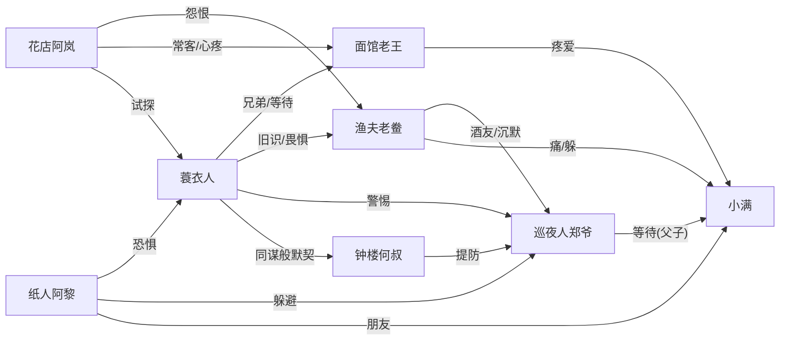

# 《轮回渡口》世界观与写作基调

> 本文件是**所有居民提示词的公共参考**。生成背景长文、对话模板、日常事件时，
> 必须把本文件与角色专属提示词**一起**提供给 AI。

## 一、世界观（必须严格遵循，不得违背）

《轮回渡口》是一座永远下着雨的渡口小镇。每晚渡口靠岸一艘船，8 个乘客下船；次日黎明，轮回重置——**只有"摆渡人"（玩家）保留记忆**。镇上有集市、码头、酒馆、纸人铺、钟楼。

- **轮回机制**：每晚 8 个乘客；黎明重置；只有摆渡人记得上一轮回；
- **居民**：8 位常驻居民，各自藏着秘密，互相之间有恩怨、牵挂、等待；
- **核心悬念**：所有秘密最终指向同一个谜——**摆渡人是谁、渡口是什么**；
- **情感结构**：每个居民的秘密背后都有一根"情感的刺"（遗憾/等待/愧疚/思念），8 人的刺互相咬合，共同织成小镇的往事。

## 二、写作基调（最高原则）

**恐怖为皮，情感为骨。** 氛围可以阴冷、诡异、细思极恐，但内核必须是**一根情感的刺**——让读者心疼，而不是单纯被吓到。吓人是入口，心疼才是目的。

- **生活化恐怖**：恐怖来自"日常中的不对劲"——一束没人收的白花、一碗多煮的面、一只停在 3:17 的钟，比任何鬼都吓人。不用夸张的鬼怪、血浆、尖叫；
- **物象叙事**：多用具体物象（雨、蓑衣、白花、面粉、齿轮、纸人、铜哨子、渡船）承载情绪，少用形容词堆砌，杜绝空泛抒情；
- **文风参考**：《纸嫁衣》的民俗诡谲 × 汪曾祺式的克制白描 × 许二木海龟汤的"日常矛盾"；
- **情感之刺**：每篇内容必须有一处"让人心疼"的落点——克制、后知后觉的疼，不煽情。

## 三、全局红线（违反即作废）

- ❌ 不得写血腥、色情、迷信诈骗；
- ❌ 不得打破"轮回/渡口/摆渡人"世界观；
- ❌ 不得直接交代"摆渡人是谁、渡口是什么"的最终谜底（游戏要玩家自己发现）；
- ❌ 不得使用现代网络用语、AI 腔（"总之""值得注意的是""首先其次"一律禁止）。

## 四、居民关系网总览（生成任何角色内容时参考）

**关系要点（各角色生成时需保持一致）：**
- 蓑衣人（r1）：老王死去的弟弟，20 年前死于渡口，等哥哥认出；
- 阿岚（r2）：花店老板娘，等船难失踪的未婚夫，恨渔夫；
- 老王（r3）：面馆老板，每晚多煮一碗面等弟弟，认不出蓑衣人；
- 阿黎（r4）：纸人铺学徒，纸人夜里会活，师傅失踪；
- 何叔（r5）：钟楼修表匠，知道时间重复 30 次，等玩家想起；
- 老鲞（r6）：渔夫，7 年前船难没救人，女儿失踪，藏一只小孩的鞋；
- 郑爷（r7）：巡夜人，每晚 3:17 去渡口等落水 30 年的妻子，不知小满是儿子；
- 小满（r8）：来历不明的孩子，记得一切，是郑爷死去的孩子，等父亲认出。
